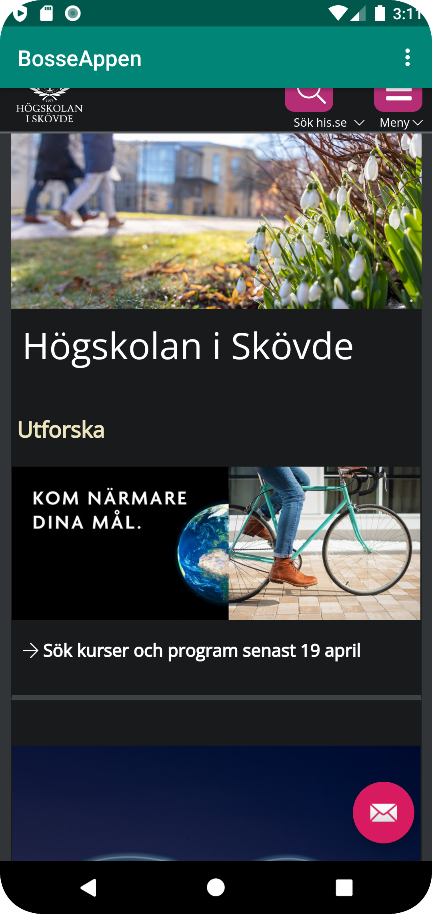

# Rapport

Hampus Wetterlind - b21hamwe - Webug21


```
<string name="app_name">BosseAppen</string>
```
Jag påbörjade arbetet med att byta namn på applikationen med hjälp av ovanstående kodexempel i
mappen values under strings.xml.

----------------------------------------------------------------------------------------------------
```
<uses-permission android:name="android.permission.INTERNET" />
 ```
Därefter gav jag applikationen internet access via raden kod ovanför i filen "AndroidManifest.xml"
under mappen Manifests.

----------------------------------------------------------------------------------------------------
```
<WebView
     android:id="@+id/my_webview" />
```
     Därefter skapade jag elementet Webviev och gav det ett ID i filen "content_main.xml" under
     mappen layout.

----------------------------------------------------------------------------------------------------
```
WebView myWebView;
```

```
myWebView = findViewById(R.id.my_webview);
```

Därefter skapade jag en privat variabel i filen MainActivity som syns i kodexemplet ovan och
initierat detta med "fiendViewByID" och lade in ID:t för mitt webb ID.

----------------------------------------------------------------------------------------------------
```
myWebView.getSettings().setJavaScriptEnabled(true);
```
I nästa steg så skapade jag koden ovanför för att göra det möjligt att köra Javascript programkod.

----------------------------------------------------------------------------------------------------

Härnäst skapade jag en ny mapp vid namn assets där jag skapade en HTML fil, i denna lade jag in en
tidigare högskole-uppgift för att lägga till lite HTML kod i filen för nästkommande steg.

----------------------------------------------------------------------------------------------------
```
    public void showExternalWebPage() {

        myWebView.loadUrl("https://his.se");
    }

    public void showInternalWebPage(){
        myWebView.loadUrl("file:///android_asset/about.html");
    }

    ```

    Därefter skapade jag möjligheten för att kunna använda sig utav en intern och extern sida på
    appen, den interna är HTML dokumentet som nämnts tidigare i rapporten och den externa är
    Högskolans egna hemsida, dessa sidor blir länkade via "loadUrl".

----------------------------------------------------------------------------------------------------

```
@Override
    public boolean onOptionsItemSelected(MenuItem item) {
        // Handle action bar item clicks here. The action bar will
        // automatically handle clicks on the Home/Up button, so long
        // as you specify a parent activity in AndroidManifest.xml.
        int id = item.getItemId();

        ```

```
if (id == R.id.action_external_web) {
            showExternalWebPage();
            Log.d("==>","Will display external web page");
            return true;
        }

        if (id == R.id.action_internal_web) {
            showInternalWebPage();
            Log.d("==>","Will display internal web page");
            return true;
        }
```

Därefter med hjälp utav "onOptionsItemSelected" och "getItemId"som gör det möjligt att klicka
sig till dessa två olika sidor, interna och externa uppe i menyn på appen tillsammans med "if"
satsen som specifierar för programmet vad som skall ske vid ett knapptryck bland de två
alternativen.

----------------------------------------------------------------------------------------------------

Denna bild representerar den externa sidan.


Denna bild representerar den interna sidan samt menyn för byte av intern och extern sida.

----------------------------------------------------------------------------------------------------


## Följande grundsyn gäller dugga-svar:

- Ett kortfattat svar är att föredra. Svar som är längre än en sida text (skärmdumpar och programkod exkluderat) är onödigt långt.
- Svaret skall ha minst en snutt programkod.
- Svaret skall inkludera en kort övergripande förklarande text som redogör för vad respektive snutt programkod gör eller som svarar på annan teorifråga.
- Svaret skall ha minst en skärmdump. Skärmdumpar skall illustrera exekvering av relevant programkod. Eventuell text i skärmdumpar måste vara läsbar.
- I de fall detta efterfrågas, dela upp delar av ditt svar i för- och nackdelar. Dina för- respektive nackdelar skall vara i form av punktlistor med kortare stycken (3-4 meningar).

Programkod ska se ut som exemplet nedan. Koden måste vara korrekt indenterad då den blir lättare att läsa vilket gör det lättare att hitta syntaktiska fel.


Bilder läggs i samma mapp som markdown-filen.


Läs gärna:

- Boulos, M.N.K., Warren, J., Gong, J. & Yue, P. (2010) Web GIS in practice VIII: HTML5 and the canvas element for interactive online mapping. International journal of health geographics 9, 14. Shin, Y. &
- Wunsche, B.C. (2013) A smartphone-based golf simulation exercise game for supporting arthritis patients. 2013 28th International Conference of Image and Vision Computing New Zealand (IVCNZ), IEEE, pp. 459–464.
- Wohlin, C., Runeson, P., Höst, M., Ohlsson, M.C., Regnell, B., Wesslén, A. (2012) Experimentation in Software Engineering, Berlin, Heidelberg: Springer Berlin Heidelberg.
